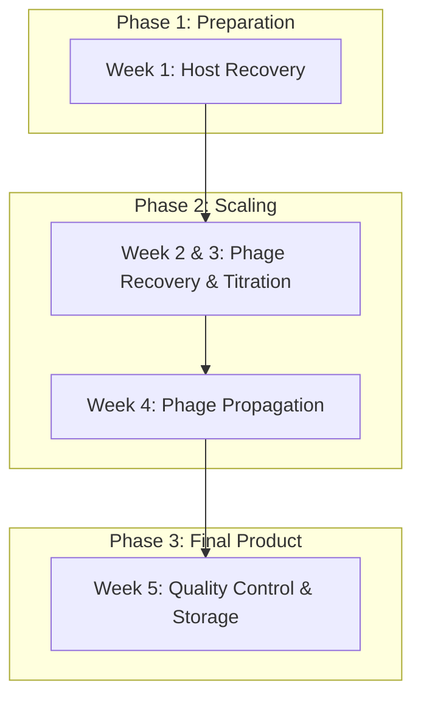
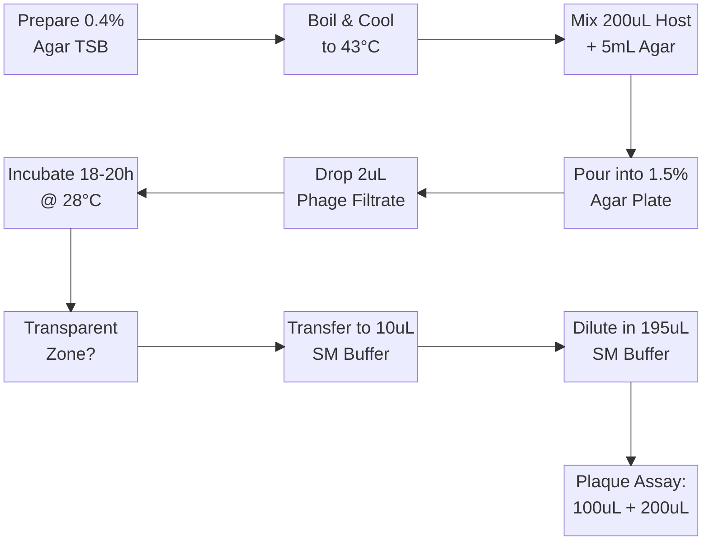
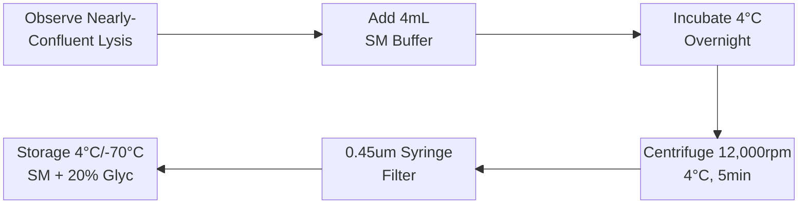

# Comprehensive Study Guide: Phage-Host Fermentation

**Subject:** Fermentation Technology / Applied Microbiology  
**Target Organisms:** _Edwardsiella tarda_ E24.1 (Host) and _E. tarda_ phage DT115P1

## 1. Experimental Workflow Overview

The experiment is structured as a "Seed-to-Product" cycle, moving from raw culture recovery to high-titer storage.

## 2. Media & Buffer Compositions

Precise chemical environments are critical for maintaining host viability and phage stability.

| Medium/Buffer | Composition | Purpose |
| :--- | :--- | :--- |
| **TSB Medium** | 3% (w/v) Tryptic Soy Broth | Basic nutrient broth for host growth. |
| **1.5% Agar TSB** | 3% TSB + 1.5% (w/v) Agar | Solid base layer for double-layer plates. |
| **0.4% Agar TSB** | 3% TSB + 0.4% (w/v) Agar | Soft top layer for phage mobility. |
| **PBS + 20% Glycerol** | 0.8% NaCl, 0.02% KCl, 0.288% Na₂HPO₄.12H₂O, 0.02% KH₂PO₄, 20% Glycerol | Cryoprotectant for bacterial host storage. |
| **SM Buffer** | 0.58% NaCl, 0.2% MgSO₄.7H₂O, 5% Tris-HCl 1M (pH 7.5), 2% Gelatin | Phage stabilization, dilution, and harvesting. |

## 3. Key Procedural Logic

### A. Host Recovery & Storage (Week 1 & 2)
- **Recovery:** Streak from freezing stock onto 1.5% Agar TSB. Incubate overnight at 28°C.
- **Inoculation:** Pick a single colony into **15 mL TSB medium** in a Falcon tube. Agitate overnight at 28°C.
- **Storage:** Mix **500 µL culture** with **500 µL PBS + 20% Glycerol** (final 10% glycerol). Store at **-70°C**.

### B. The Double-Layer Agar Technique
This is the "Golden Standard" for phage work. It utilizes two different concentrations of agar to balance structural integrity with viral mobility.
- **Bottom Layer (1.5% Agar):** Provides a solid, nutrient-rich base.
- **Top Layer (0.4% Soft Agar):** 
    - **The Physics:** The low concentration creates a porous matrix.
    - **The Biology:** Allows phage progeny to diffuse and infect adjacent bacteria.
    - **The Result:** Formation of a **Plaque** (a "negative" colony representing one initial PFU).
- **Incubation:** Plaques become visibly distinguishable after **6–8 hours at 28°C**.

### C. Liquid vs. Solid Propagation (Week 4)

| Feature | Liquid Propagation | Agar Plate Propagation |
| :--- | :--- | :--- |
| **Medium** | 50 mL TSB in 250 mL Flask | TSB 0.4% Soft Agar Overlay |
| **Inoculum** | 2% (v/v) overnight host culture | 200 µL host + 100 µL diluted lysate |
| **Kinetics** | Agitate to **OD₅₉₅ = 0.1** (~2.10⁸ CFU/mL) before adding phage | Slower, but higher local concentration |
| **Incubation** | **6 hours** or until lysate clears | Overnight for confluent lysis |
| **Indicator** | Lysate "clears" (turbidity drops) | Confluent lysis (lawn disappears) |
| **Harvesting** | Centrifuge (12,000rpm, 5min) & Filter | SM Buffer soaking overnight |

## 4. Mathematical & Biological Modeling

### Multiplicity of Infection (MOI)
In your propagation step, you used an **MOI of 0.1**.
$$MOI = \frac{\text{Phage Particles}}{\text{Host Cells}}$$

**Why 0.1?**
- **If MOI > 1:** Every cell is infected immediately. The culture "crashes" before multiple generations of phages can be produced.
- **If MOI = 0.1:** Only 1 in 10 cells is infected initially. This allows uninfected cells to continue dividing, providing a "factory" for the next wave of phage progeny.

### Phage Titration Formula
$$PFU/mL = \frac{\text{Plaque Count}}{\text{Volume Plated (mL)} \times \text{Dilution Factor}}$$

## 5. Technical Flowcharts
### Phage Recovery (Week 2: Drop & Plaque Assay)

### Phage Harvesting (Plate Method)

## 6. Critical Troubleshooting for Oral Exam

**Q1: Why 43°C for the soft agar?**
- **Answer:** It's the "Goldilocks" temperature. Below 40°C, agar solidifies (clumps). Above 45–48°C, you risk inducing heat-shock or killing the _E. tarda_ host cells.

**Q2: What is the role of MgSO₄ in SM Buffer?**
- **Answer:** Divalent cations ($Mg^{2+}$) stabilize the phage capsid proteins and are often required as cofactors for the phage to adsorb (attach) to the bacterial cell wall.

**Q3: Why filter-sterilize at 0.45 $\mu m$ instead of autoclaving the final product?**
- **Answer:** Phages are made of proteins and nucleic acids; heat sterilization (autoclaving) would denature them. Filtration removes bacteria (~1–2 $\mu m$) while letting phages (~0.05–0.2 $\mu m$) pass through.

## 7. Vocabulary Checklist
- **Adsorption:** The physical attachment of a phage to the host receptor.
- **Lysis:** The bursting of the host cell to release new virions.
- **Tryptic Soy Broth (TSB):** The nutrient medium used for _E. tarda_.
- **Glycerol (10-20% final):** The cryoprotectant used to prevent ice crystal formation in the -70°C freezer.
- **SM Buffer:** "Salt-Magnesium" buffer used for phage manipulation.
- **Plaque Forming Unit (PFU):** A measure of number of particles capable of forming plaques per unit volume.