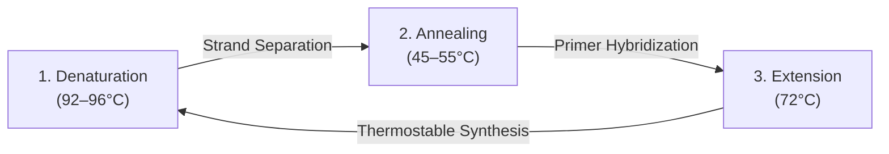
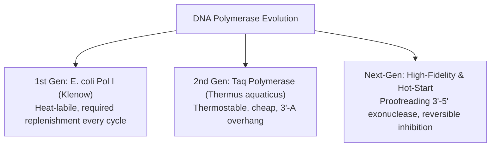
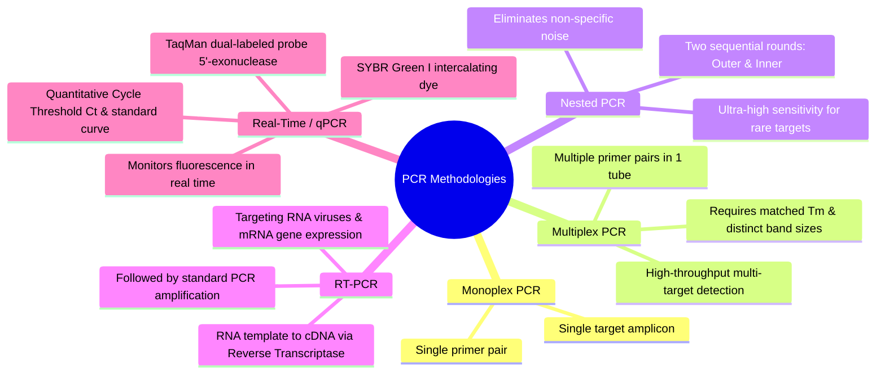
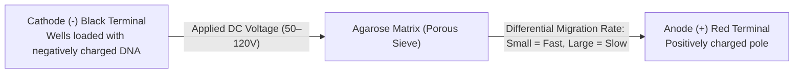

# Chapter 2: PCR & Electrophoresis

## Chapter Outline
1. **Section I**: Polymerase Chain Reaction (PCR)
   - Biological Foundation (*In Vivo* Replication vs. *In Vitro* Amplification)
   - History & Development of PCR
   - PCR Principles & Thermal Cycling Stages
   - Key Reaction Components (Polymerases, Primers, dNTPs, Buffers, Thermal Cyclers)
   - Specialized PCR Methodologies (Monoplex, Multiplex, Nested, RT-PCR, Real-Time / qPCR)
2. **Section II**: Electrophoresis
   - Principles of Agarose Gel Electrophoresis (AGE)
   - Molecular Sizing, Charge Migration & Band Resolution
   - Visualization and Downstream Verification

---

## I. Polymerase Chain Reaction (PCR)

### 1. Biological Foundation: *In Vivo* vs. *In Vitro* Replication

#### *In Vivo* DNA Replication in Living Cells (Prokaryotes & Eukaryotes)
In living systems, DNA replication requires a complex, multi-enzyme molecular apparatus operating at physiological temperatures:
- **DNA Helicase**: Unwinds the parental double-stranded DNA helix at the replication fork.
- **Single-Strand DNA-Binding Proteins (SSBs)**: Stabilize single-stranded parental templates to prevent re-annealing and secondary hairpin formation.
- **DNA Primase**: Synthesizes short RNA primers providing free $3'\text{-OH}$ groups.
- **DNA Polymerase**: Continuously synthesizes the leading strand ($5' \to 3'$) and discontinuously extends Okazaki fragments on the lagging strand.
- **DNA Ligase**: Phosphodiester bond-forming enzyme that covalently seals nicks between adjacent Okazaki fragments after RNA primer removal.

#### Viral Replication Paradigms
- **DNA Viruses (e.g., Poxviruses)**: Utilize viral DNA genome for transcription into mRNA and replication of progeny viral genomes using host/viral polymerases.
- **RNA Viruses (e.g., Polioviruses, Retroviruses)**: Utilize RNA genomes requiring RNA-dependent RNA polymerases (RdRP) or reverse transcriptase (RT) within host cells for replication and protein synthesis.
- **Core Requirement**: All viruses require host cell metabolic machinery and structural components to replicate.

#### Why Replicate Genetic Materials *In Vitro* (In Test Tubes)?
1. **Gene Cloning & Recombinant DNA Technology**:
   - Amplifying specific protein-coding genes (e.g., the human insulin gene) for insertion into expression plasmids, bacterial transformation, and recombinant pharmaceutical synthesis (covered in detail in Chapter 3).
2. **Molecular Diagnostics & Detection**:
   - Rapidly detecting trace amounts of pathogen genomes (viruses, bacteria, fungi) or genetic mutations in clinical and environmental specimens.
3. **Sequencing Preparation**:
   - Target amplification generates the microgram-level copy quantities required for Sanger or Next-Generation Sequencing ($\text{Amplification} \to \text{Sequencing}$).

---

### 2. History of PCR
- **Inventor**: **Kary B. Mullis** (1944 – 2019).
- **Invention Timeline**:
  - Conceptualized in **1983 / 1985** (*"The idea of PCR came to him while driving with his girlfriend on a highway... It was quiet and something just went, Click!"*).
  - Awarded the **Nobel Prize in Chemistry in 1993** for inventing the Polymerase Chain Reaction method.

---

### 3. Principles & Thermal Cycling Stages of PCR

PCR replaces the enzymatic machinery of cellular replication (helicases, SSBs, primases) with **thermal cycling** and **synthetic primers**:



| PCR Stage | Vietnamese Term | Temperature | Biochemical Mechanism & Physical Event |
| :--- | :--- | :--- | :--- |
| **1. Denaturation** | *Giai đoạn biến tính* | **$92^\circ\text{C} - 96^\circ\text{C}$** | High thermal energy breaks the hydrogen bonds between complementary base pairs ($\text{A-T}$ and $\text{G-C}$), unzipping dsDNA into two single strands. |
| **2. Annealing** | *Giai đoạn bắt cặp* | **$45^\circ\text{C} - 55^\circ\text{C}$** | Temperature drops below primer $T_m$ ($\sim T_m - 5^\circ\text{C}$), allowing synthetic forward and reverse primers to hybridize specifically to complementary target sequences. |
| **3. Extension (Elongation)** | *Giai đoạn kéo dài* | **$72^\circ\text{C}$** | Optimum catalytic temperature for thermostable DNA polymerase (e.g., *Taq*). The enzyme incorporates free dNTPs in the $5' \to 3'$ direction, extending from the primer $3'\text{-OH}$ terminus. |

- **Amplification Kinetics**:
  $$\text{Theoretical Yield} = N_0 \times 2^n$$
  Where $N_0$ is the initial template copy number and $n$ is the number of thermal cycles (typically 25–35 cycles yielding up to $10^9$-fold amplification).

---

### 4. Essential Chemical & Biological Components in a PCR Mix

A standard PCR reaction mixture ($20 - 50\,\mu\text{L}$) requires five fundamental components:
1. **DNA Polymerase Enzyme**: Thermostable enzyme catalyzing $5' \to 3'$ phosphodiester bond formation.
2. **DNA Template**: Extracted genomic DNA, cDNA, plasmid DNA, or crude microbial mass containing the target sequence.
3. **Deoxynucleotide Triphosphates (dNTPs)**: Equimolar mixture of **dATP, dTTP, dCTP, dGTP** providing both nucleotide substrates and energy for polymerization.
4. **Primers (Forward & Reverse)**: Short synthetic oligonucleotides defining the specific amplification boundaries.
5. **Reaction Buffer**: Standard commercial buffer maintaining pH (typically $\text{pH } 8.3-8.8$ at room temperature), ionic strength ($\text{KCl}$), and essential $\text{Mg}^{2+}$ cofactors ($\text{MgCl}_2$).

---

### 5. Detailed Component Specifications & Molecular Engineering

#### A. DNA Polymerases: Evolution & Variants



| Polymerase Type | Source Organism | Key Characteristics | Advantages | Disadvantages / Limitations |
| :--- | :--- | :--- | :--- | :--- |
| ***E. coli* DNA Polymerase I** (Klenow Fragment) | *Escherichia coli* (Mesophile) | Early historical PCR; optimal at $37^\circ\text{C}$. | Historical proof-of-concept. | **Heat-labile**: Inactivated at $95^\circ\text{C}$ denaturation, requiring manual addition of fresh enzyme after every single cycle. |
| **Taq Polymerase** | *Thermus aquaticus* (Thermophile, Yellowstone hot springs) | Thermostable (half-life $> 40\text{ min}$ at $95^\circ\text{C}$); optimum at $72^\circ\text{C}$. | • Thermostable (enables full automation).<br>• Inexpensive.<br>• **Non-template $3'\text{-dA}$ overhang**: Adds an extra adenine at $3'$ ends, enabling direct **TA cloning** into vectors. | • **No $3' \to 5'$ proofreading exonuclease activity**.<br>• Higher error rate ($\sim 10^{-4}$ to $10^{-5}$ errors/bp).<br>• Risk of non-specific amplification or **gel smear**. |
| **High-Fidelity Polymerases** (e.g., Pfu, Q5, Phusion) | *Pyrococcus furiosus* (Hyperthermophilic archaeon) | Possesses intrinsic **$3' \to 5'$ exonuclease proofreading** activity. | • **Extremely low error rate** ($\sim 10^{-6}$ to $10^{-7}$; $50-100\times$ higher fidelity than Taq).<br>• Ideal for cloning, sequencing, and mutagenesis.<br>• Generates **blunt-ended** amplicons. | • Slower extension rates than Taq (unless engineered).<br>• Blunt ends require blunt-vector cloning (incompatible with TA cloning). |
| **Hot-Start Polymerases** | Chemically modified or antibody-bound *Taq* | Catalytic center blocked by a **reversible inhibitor** (monoclonal antibody, chemical moiety, or aptamer) at $< 60^\circ\text{C}$. | • **Eliminates non-specific binding & primer-dimers** during ambient temperature pipetting.<br>• Activated by initial heat pulse ($> 60^\circ\text{C}$ to $95^\circ\text{C}$ for $1-5\text{ min}$). | • Requires initial high-temperature activation step. |

#### B. PCR Primers (Forward and Reverse Oligonucleotides)
- **Biological Role**: Provide free $3'\text{-OH}$ groups for DNA polymerase extension and confer sequence specificity.
- **Key Design Parameters**:
  - **Length**: Typically **$20 - 30\text{ nucleotides (nt)}$** (ensures unique hybridization in complex genomic backgrounds).
  - **Melting Temperature ($T_m$)**:
    - Empirical nearest-neighbor calculation or Wallace rule:
      $$T_m = 2^\circ\text{C} \times (A + T) + 4^\circ\text{C} \times (G + C)$$
    - Forward and reverse primer pairs must have matched $T_m$ values ($\Delta T_m \le 2-5^\circ\text{C}$), typically in the range of $55^\circ\text{C}-65^\circ\text{C}$.
  - **GC Content**: $40\% - 60\%$ with uniform distribution; avoid strong 3' GC clamps ($> 3$ G/C bases at the $3'$ end) to prevent non-specific priming.
  - **Primer Orientation & Annealing Architecture**:
    - **Forward Primer ($5' \to 3'$)**: Identical to sense strand; binds complementary antisense (bottom $3' \to 5'$) template strand, extending rightward.
    - **Reverse Primer ($5' \to 3'$)**: Reverse complement of sense strand; binds sense (top $5' \to 3'$) template strand, extending leftward.
  - **Synthesis & Procurement**: Custom chemically synthesized by commercial vendors (e.g., IDT, Macrogen, Thermo Fisher, Phusa Biochem).

#### C. Other Chemical Components
- **DNA Template**:
  - Purified genomic DNA, viral/bacterial RNA-derived cDNA, plasmid DNA (isolated as described in Chapter 1), or intact cell suspension (colony PCR).
  - Concentration: Typically $1-100\text{ ng}$ of plasmid/viral DNA or $50-250\text{ ng}$ of human genomic DNA per reaction.
- **Deoxynucleoside Triphosphates (dNTPs)**:
  - Equimolar mixture ($200\,\mu\text{M}$ each of dATP, dTTP, dCTP, dGTP).
  - Imbalanced dNTP concentrations increase polymerase misincorporation and error rates.
- **PCR Buffer & Divalent Cations ($\text{Mg}^{2+}$)**:
  - $10\times$ Buffer contains Tris-HCl ($\text{pH } 8.3-8.8$), $\text{KCl}$ ($50\text{ mM}$ to facilitate primer annealing).
  - **$\text{MgCl}_2$ ($1.5 - 2.5\text{ mM}$)**: $\text{Mg}^{2+}$ is an obligatory catalytic cofactor for DNA polymerase and stabilizes primer-template duplexes. Excess $\text{Mg}^{2+}$ promotes non-specific bands; insufficient $\text{Mg}^{2+}$ eliminates PCR yield.

---

### 6. Thermal Cycler Instrumentation (PCR Machines)
- **First-Generation Systems (Historical)**:
  - Utilized a robotic arm mechanically transferring microcentrifuge tubes between three separate thermostatted water baths ($95^\circ\text{C} \to 55^\circ\text{C} \to 72^\circ\text{C}$).
  - Required mineral oil overlay to prevent sample evaporation.
- **Modern Thermocyclers**:
  - Employ solid aluminum/silver blocks driven by solid-state **Peltier thermoelectric elements** for rapid heating and cooling ramp rates ($3 - 6^\circ\text{C}/\text{s}$).
  - Include an integrated **heated lid** ($105^\circ\text{C}$) preventing sample evaporation and condensation on tube caps, eliminating mineral oil requirements.

---

### 7. Specialized PCR Methodologies & Variations



#### 1. Monoplex PCR (*PCR đơn mồi*)
- **Definition**: Standard conventional PCR employing a **single pair of primers** (1 Forward, 1 Reverse) to amplify one specific DNA region per tube.
- **Application**: Basic genotyping, single-gene cloning, single-pathogen presence/absence confirmation.

#### 2. Multiplex PCR (*PCR đa mồi*)
- **Definition**: A molecular technique enabling the **simultaneous amplification of multiple target DNA sequences** within a single reaction tube using multiple distinct primer pairs.
- **Mechanism**: Each primer pair targets a specific pathogen gene or locus, yielding amplicons of distinct base-pair sizes that can be resolved simultaneously on an agarose gel.
- **Key Advantages**:
  - **Resource & Cost Efficient**: Dramatically saves laboratory reagents, preparation time, and precious clinical sample volume.
  - **High-Throughput Screening**: Enables syndromic panel screening (e.g., respiratory, gastrointestinal, or STI pathogen panels).
- **Limitations & Optimization Challenges**:
  - **Primer Competition & Interactions**: Cross-hybridization between primer sets and competition for dNTPs/polymerase can lead to unequal amplicon yields or primer-dimers.
  - **Design Rigor**: All primer pairs must share closely matched annealing temperatures ($T_m$) and generate clearly separated product sizes (minimum 30–50 bp difference for gel resolution).

#### 3. Nested PCR (*PCR tổ*)
- **Definition**: A specialized two-round amplification strategy engineered to **maximize specificity and eliminate non-specific background amplification**.
- **Two-Round Architecture**:
  1. **Round 1 (Outer PCR)**: Uses an **outer primer pair** that binds to broad regions flanking the target gene.
  2. **Round 2 (Inner / Nested PCR)**: Uses a diluted aliquot from Round 1 as template and a second set of **inner (nested) primers** that hybridize strictly *inside* the primary amplicon.
- **Key Advantages**:
  - **Virtual Elimination of False Positives**: Non-specific amplicons generated in Round 1 will not contain binding sites for the inner primers, preventing second-round amplification.
  - **Extreme Sensitivity**: Capable of detecting single-digit copies of target DNA in heavy background genomic DNA (ideal for latent viral reservoirs, minimal residual disease).

#### 4. Reverse Transcription PCR (RT-PCR)
- **Definition**: Combines **Reverse Transcription (RT)** with standard PCR to detect and quantify RNA templates.
- **Two-Step Reaction Sequence**:
  - **Step 1 (cDNA Synthesis)**: The enzyme **Reverse Transcriptase** (RNA-dependent DNA polymerase) reverse-transcribes single-stranded RNA (mRNA, viral RNA) into complementary DNA (**cDNA**) using oligo-dT, random hexamers, or gene-specific primers and dNTPs.
  - **Step 2 (PCR Amplification)**: Conventional thermostable DNA polymerase amplifies the synthesized cDNA exponentially.
- **Major Applications**: Detection of RNA viruses (e.g., SARS-CoV-2, Dengue, Influenza, HIV) and quantification of mRNA expression levels.

#### 5. Real-Time Quantitative PCR (qPCR / *PCR định lượng*)
- **Definition**: An advanced PCR technology that tracks and measures DNA amplification **in real time** during each thermal cycle using fluorescent signaling, eliminating the need for post-PCR agarose gel electrophoresis.
- **Core Chemistries**:

| Chemistry | Mechanism | Advantages | Limitations |
| :--- | :--- | :--- | :--- |
| **Non-Specific Dye (SYBR Green I)** | • Fluoresces strongly upon intercalating into the minor groove of **any double-stranded DNA**.<br>• Fluorescence intensity increases proportionally with accumulating dsDNA amplicons. | • Universal, cost-effective.<br>• Requires no probe design. | • Binds non-specifically to primer-dimers and off-target amplicons.<br>• Requires **Melt Curve Analysis** ($\text{d}F/\text{d}T$) to verify single-peak specificity. |
| **Probe-Based Assay (TaqMan Probe)** | • Utilizes a sequence-specific oligonucleotide labeled with a **5'-Reporter fluorophore (R)** and a **3'-Quencher (Q)**.<br>• Intact probe: Fluorescence Resonance Energy Transfer (FRET) quenches emission.<br>• During primer extension, *Taq* polymerase's intrinsic **$5' \to 3'$ exonuclease activity** hydrolyzes the hybridized probe, releasing the reporter from quenching and emitting signal. | • **Absolute sequence specificity**.<br>• Enables multiplexing within the same tube using different fluorophore dyes (e.g., FAM, VIC, CY5). | • Higher cost per reaction.<br>• Requires specialized fluorescent probe design and synthesis. |

#### Real-Time PCR Data Analysis & Quantification Parameters


- **Amplification Plot Kinetics**:
  - **Baseline Fluorescence**: The low background fluorescence emitted during early cycles (cycles 3–15) prior to detectable exponential amplicon accumulation.
  - **Fluorescence Threshold (*Ngưỡng huỳnh quang*)**: A statistically defined level of fluorescence positioned significantly above the background baseline within the geometric (exponential) phase of amplification.
  - **Cycle Threshold ($C_t$ / *Chu kỳ ngưỡng*)**:
    - The exact fractional cycle number at which the target amplification curve intersects the threshold line.
    - **Fundamental Quantitative Rule**: $C_t$ is **inversely proportional** to the logarithm of the starting template copy number ($\log_{10} N_0$).
    - Higher initial target copies $\implies$ earlier threshold crossing $\implies$ **lower $C_t$ value** (e.g., $10^7$ copies yield $C_t \approx 15$, whereas $10^1$ copies yield $C_t \approx 35$).
    - Samples with no target or negative control (NTC - No Template Control) do not cross the threshold ($C_t = \text{Undetermined}$).

- **Standard Curve & Quantitative Formulation**:
  - Constructed by plotting $C_t$ values against known serial dilutions of starting target standard copies ($\log_{10} \text{Copy Number}$):
    $$C_t = -m \cdot \log_{10}(N_0) + b$$
  - **Amplification Efficiency ($E$)**:
    $$E = 10^{-1/\text{slope}} - 1$$
    - An ideal PCR doubling reaction produces a slope of $\mathbf{-3.32}$, corresponding to **$100\%$ efficiency** ($E = 1.00$) with a coefficient of determination $R^2 \ge 0.99$.

---

### 8. Comparative Matrix of PCR Methodologies

| PCR Method | Target Input | Primer / Probe System | Key Detection Mechanism | Primary Strength | Typical Diagnostic & Research Application |
| :--- | :--- | :--- | :--- | :--- | :--- |
| **Monoplex PCR** | DNA / cDNA | 1 Primer Pair (F + R) | End-point Agarose Gel Electrophoresis | Simplicity & low cost | Routine gene amplification, colony screening |
| **Multiplex PCR** | DNA / cDNA | Multiple distinct Primer Pairs | End-point Gel Electrophoresis (multi-band) | High throughput; saves sample & reagents | Syndromic pathogen panels, forensic STR profiling |
| **Nested PCR** | DNA / cDNA | 2 Primer Pairs (Outer + Inner) | End-point Gel Electrophoresis | Maximum specificity & sensitivity | Rare targets, low-copy latent viral loads |
| **RT-PCR** | RNA (mRNA / Viral RNA) | Reverse Transcriptase + PCR Primers | cDNA synthesis $\to$ End-point Gel or qPCR | Transcribes RNA to amplifiable cDNA | RNA virus detection (SARS-CoV-2, HIV, Flu), mRNA expression |
| **Real-Time qPCR** | DNA / cDNA | Primers $\pm$ Fluorescent Probes (TaqMan / SYBR) | Real-time fluorescence tracking ($C_t$ kinetics) | Direct absolute/relative quantification, no gel required | Viral load monitoring, biomarker quantitation, gene expression |

---

## II. Electrophoresis

### 1. Fundamental Principles & Definition
- **Definition**: An analytical and preparative laboratory technique that separates charged biological macromolecules (DNA, RNA, or proteins) according to their **physical molecular size (length in base pairs)** and **net electrical charge** under the influence of an applied electric field.
- **Agarose Gel Electrophoresis (AGE)**: The universal standard matrix system used for resolving DNA and RNA fragments ranging from $100\text{ bp}$ to $> 20\text{ kb}$.



### 2. Biophysical Separation Mechanism

#### A. Charge and Migration Direction
- DNA possesses a constant negative charge-to-mass ratio due to the polyanionic phosphate groups ($-\text{PO}_4^{3-}$) along its sugar-phosphate backbone.
- When placed in a conductive buffer (e.g., $1\times\text{TAE}$ or $1\times\text{TBE}$) under a direct current (DC) electric field, DNA molecules uniformly migrate toward the **positive electrode (Anode, $\mathbf{+}$)** away from the **negative electrode (Cathode, $\mathbf{-}$)**:
  $$\text{Direction of Migration}: \quad \mathbf{\text{Cathode } (-)} \longrightarrow \mathbf{\text{Anode } (+)} \quad \text{("Run to the Red")}$$

#### B. Molecular Sieving by Agarose Matrix
- The cross-linked polymer network of agarose forms a three-dimensional matrix with microscopic pores.
- **Small DNA Fragments**: Experience low hydrodynamic friction and navigate through gel pores rapidly, migrating furthest toward the positive electrode.
- **Large DNA Fragments**: Encounter significant physical friction and spatial hindrance, migrating slowly and remaining closer to the loading wells near the negative electrode.
- **Mathematical Relationship**: In a uniform agarose gel, the electrophoretic mobility ($\mu$) of linear double-stranded DNA is inversely proportional to the base-10 logarithm of its molecular weight / base-pair length ($\mu \propto 1/\log_{10}(\text{bp})$).

```
                      ELECTROPHORESIS TANK SETUP
               Negative Electrode / Cathode (-) [Black]
           +---------------------------------------------+
           |   [Well 1]    [Well 2]   [Well 3]  [Well 4]  |
           |    Ladder      Sample 1   Sample 2  Sample 3 |
           |      |                                      |
5000 bp -> |   ======                  ======            | <- Largest / Slowest
1500 bp -> |   ======       ======                       |
 500 bp -> |   ======                  ======    ======  | <- Smallest / Fastest
           |      v           v          v         v     |
           |      |           |          |         |     |
           |      +-----------+----------+---------+     |
           +---------------------------------------------+
               Positive Electrode / Anode (+) [Red]
```

### 3. Practical Components of Agarose Gel Electrophoresis

1. **Agarose Matrix Concentration**:
   - $0.7\% - 1.0\%$ Agarose: Optimal for resolving large DNA fragments ($1 - 10\text{ kb}$).
   - $1.5\% - 2.0\%$ Agarose: Optimal for resolving small DNA fragments and PCR amplicons ($100 - 1000\text{ bp}$).
2. **Electrophoresis Buffers**:
   - **TAE (Tris-Acetate-EDTA)**: Best for preparative gel extraction and large fragments.
   - **TBE (Tris-Borate-EDTA)**: Higher buffering capacity, sharper resolution for small fragments ($< 1\text{ kb}$).
3. **DNA Loading Dye (Sample Buffer)**:
   - Contains density agents (**Glycerol** or **Ficoll**) ensuring DNA samples sink to the bottom of the wells.
   - Contains visible tracking dyes (e.g., **Bromophenol Blue**, **Xylene Cyanol**) to visually monitor migration progress during the run.
4. **DNA Ladder (Molecular Weight Marker)**:
   - A standardized commercial cocktail of DNA fragments with exact, known sizes (e.g., $500\text{ bp}, 1500\text{ bp}, 5000\text{ bp}$).
   - Loaded into a reference lane to determine amplicon size and approximate template mass by comparative band brightness.
5. **Fluorescent DNA Intercalating Dyes & Visualization**:
   - **Staining Agents**: Ethidium Bromide ($\text{EtBr}$), GelRed, or SYBR Safe intercalate between adjacent base pairs of DNA.
   - **Detection**: Under Ultraviolet ($\text{UV}$, $\lambda = 302 - 312\text{ nm}$) or Blue LED illumination, bound fluorophores emit visible fluorescent light, revealing crisp DNA bands on a gel documentation system.

---

## III. Key Takeaway Summary Checklist

- [x] **In Vivo vs. In Vitro Replication**: Cellular replication relies on multi-enzyme complexes (helicase, SSB, primase, ligase); PCR achieves strand separation and initiation via **thermal cycling** and **synthetic primers**.
- [x] **PCR Origin**: Invented by **Kary B. Mullis** (1983/1985), awarded the Nobel Prize in Chemistry in 1993.
- [x] **Three Thermal Cycling Stages**:
  - **Denaturation** ($92 - 96^\circ\text{C}$): Unwinds dsDNA to single strands.
  - **Annealing** ($45 - 55^\circ\text{C}$ / $T_m - 5^\circ\text{C}$): Primers hybridize to complementary flanking target regions.
  - **Extension** ($72^\circ\text{C}$): Thermostable polymerase synthesizes complementary strands $5' \to 3'$.
- [x] **Polymerase Selection**:
  - *Taq* polymerase: Thermostable, inexpensive, leaves $3'\text{-A}$ overhangs (TA cloning), lacks $3' \to 5'$ proofreading ($\text{error rate } 10^{-4}-10^{-5}$).
  - High-fidelity (*Pfu*): Has $3' \to 5'$ proofreading exonuclease ($\text{error rate } 10^{-6}-10^{-7}$), leaves blunt ends.
  - Hot-Start *Taq*: Reversibly inhibited at room temperature to eliminate non-specific priming and primer-dimers.
- [x] **Primer Design Parameters**: $20-30\text{ nt}$ length, $40-60\%\text{ GC}$, matched $T_m$ ($55-65^\circ\text{C}$), minimal 3' complementarity.
- [x] **Five Specialized PCR Variations**: Monoplex (1 target), Multiplex (multiple targets/tube), Nested (2 sequential rounds for ultra-specificity), RT-PCR (RNA $\to$ cDNA $\to$ PCR), Real-Time qPCR (kinetic quantification via SYBR Green or TaqMan probe).
- [x] **Real-Time qPCR Quantitative Kinetics**: Cycle threshold ($C_t$) is inversely proportional to initial target copy number ($\log N_0$); Standard curve slope of $-3.32$ denotes $100\%$ efficiency.
- [x] **Gel Electrophoresis Separation Principle**: Negative DNA phosphate backbone migrates toward the positive anode ($\text{Cathode } (-) \to \text{Anode } (+)$); agarose pores sieve fragments inversely proportional to $\log_{10}(\text{size in bp})$.

---

## Related Documents & Cross-References
- [[Chapter 1 - Nucleic Acids Extraction and Purification|Chapter 1: Nucleic Acids Extraction and Purification]]
- [[../_pdf/Chapter 2 - OISP.pdf|Chapter 2 Source Lecture Slides (OISP PDF)]]


