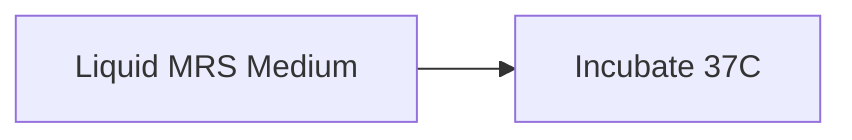
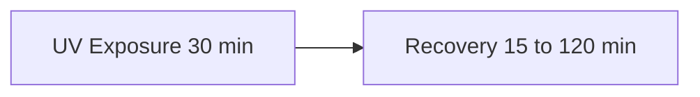
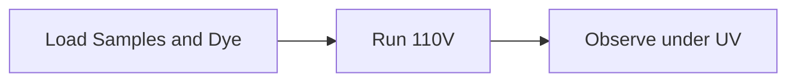

# Molecular Biology Lab Fundamentals and Procedures

## Block 1 Cultivation and UV Treatment

### Phase 1 Growth

### Phase 2 UV Treatment

### Phase 3 Harvesting

### Why use MRS medium to grow the bacteria?
Answer: MRS is a specialized medium designed for Lactobacillus. It contains specific nutrients like peptones and yeast extract. It is slightly acidic, which is the perfect environment for these bacteria to thrive while inhibiting others.

### Why is the incubator set to 37C?
Answer: 37C mimics the natural environment where these bacteria grow best. It is the optimal temperature for their enzymes to function for growth and division.

### Why expose the bacteria to UV light for 30 minutes?
Answer: UV light is used to damage the DNA, specifically by creating thymine dimers. This allows us to study the impact of DNA damage and how the bacteria attempt to repair it.

### Why must the Petri dish lid be open during UV exposure?
Answer: Plastic and glass lids block most UV radiation. If the lid is closed, the UV rays will not reach the bacteria, and no DNA damage will occur.

### Why centrifuge at 6000g after UV exposure?
Answer: The spinning force pulls the heavy bacterial cells to the bottom of the tube to form a pellet. This allows us to pour off the liquid medium and focus on the cells.

### Why do different groups wait for different times after UV exposure?
Answer: This waiting period allows the bacteria time to perform DNA repair. By varying the time from 15 to 120 minutes, we can compare how much repair happens over time.

### What is a control group in this experiment?
Answer: The control group is the bacteria that are NOT exposed to UV. We use them as a baseline to see what healthy, undamaged DNA looks like compared to the treated samples.

---

## Block 2 DNA Extraction Trizol Method

### Phase 1 Lysis

### Phase 2 Layer Separation

### Phase 3 Back Extraction

### Phase 4 Purification

### What does Trizol do to the bacterial cells?
Answer: It lyses or breaks open the cell walls and membranes. It also deactivates enzymes called DNases that would otherwise destroy the DNA.

### What is the job of chloroform in this extraction?
Answer: Chloroform is used for phase separation. Because it is heavy and does not mix with water, it helps the mixture split into layers so we can pull the DNA away from the proteins.

### Why centrifuge at 12000g and 4C?
Answer: High speed is needed to force the chemicals into layers. The cold temperature keeps the DNA stable and prevents heat from damaging it during the fast spinning.

### What are the three layers after centrifuging with Chloroform?
Answer: The top aqueous layer contains RNA. The middle interphase layer contains proteins. The bottom organic layer contains DNA and lipids.

### What does BEB or Back Extraction Buffer do?
Answer: It rescues the DNA from the bottom organic layer. It moves the DNA into a clean aqueous phase so we can collect it without the toxic organic chemicals.

### Why add cold isopropanol to the liquid?
Answer: Isopropanol makes the DNA precipitate or turn into a solid. Since DNA does not dissolve in alcohol, it forms a tiny clump or pellet we can see and spin down.

### Why wash the pellet with 70 percent ethanol instead of 100 percent?
Answer: 70 percent ethanol contains some water which is necessary to dissolve and wash away the salts. 100 percent ethanol would just trap the salts inside the DNA pellet.

---

## Block 3 PCR and Electrophoresis

### Phase 1 PCR Amplification

### Phase 2 Gel Preparation

### Phase 3 Running and Viewing

### What is Taq polymerase?
Answer: It is a heat-stable enzyme that builds new DNA strands. It comes from a bacteria that lives in hot springs, so it does not die during the high heat steps.

### What are primers and why do we need two?
Answer: Primers are short starter pieces of DNA. We need a Forward and a Reverse primer to mark the start and the end of the specific gene we want to copy.

### How does an Agarose gel sort DNA by size?
Answer: The gel is like a filter with tiny holes. Small DNA pieces move through the holes easily and fast. Large pieces get stuck and move slowly.

### Why does DNA move toward the Positive Red electrode?
Answer: DNA has a negative charge because of its phosphate backbone. In an electric field, the negative DNA swims toward the positive pole.

### What is the difference between Loading Buffer and GelRed?
Answer: Loading Buffer makes the sample heavy so it sinks into the well and adds color so you can see it while loading. GelRed stays inside the DNA and glows under UV light so you can see the results.
